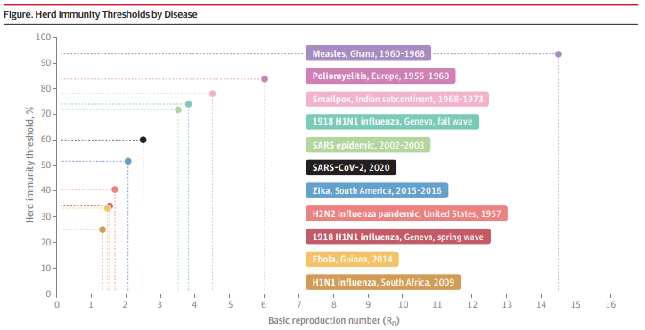

#  {.tabset}

## The Coronavirus

The Coronavirus disease 2019 or COVID-19 is a contagious virus that has spread throughout the entire world. The virus first originated sometime in December 2019 in Wuhan, China. The virus itself is spread through the inhalation of airborne particles and droplets and because it is an infectious disease, it is highly transmissible between an infected individual and a non-infected individual.

## A Return To Normal

There have been many media discussions about a return to normal and when our lives will return to as they were before March 2020. Many terms have been included in the vernacular of our daily lives such as Herd Immunity and Vaccine Distribution. In order to assist in giving an answer to the question dominating our lives, with data I will attempt to demonstrate and answer how effective vaccines have been to the spread of the Coronavirus Disease by correlating the number of vaccinations initiated and vaccinations completed to new cases, reviewing historic data and measuring the effectiveness of the vaccines in preventing new cases, and reviewing the successful mitigation of Coronavirus in highly successful countries versus efforts from unsuccessful countries in order to plot data trends. Algorithms that will be used in this research will be regression techniques: Non-Linear Regression to map infection trends and to map vaccinations. I will attempt to use time series modeling to demonstrate vaccination rates and if they are successful in mitigation the progress of the virus.

The benefit of mapping trends will give an idea of how successful efforts are against the Coronavirus. The purpose of this data review is to demonstrate when a "return to normal" will finally be possible.

## Background

Efficacy and duration of protection of a licensed vaccine will be a major issue ^[1]^ in the prediction of when we will reach Herd Immunity in the United States.

**What is Herd Immunity?**

To put it simply: "Herd immunity is the inability of infected individuals to propagate an epidemic outbreak due to lack of contact with sufficient numbers of susceptible individuals. "^[3]^

Essentially to get to goal of "Herd Immunity" the population must get to a point where immunity to an infection has been diffused throughout the population being infected, whether by vaccination or natural immunity from previous infection, that the infection can no longer be propagated by infected individuals which breaks the chain of virus outbreaks among susceptible individuals.

Various aspects come into play when discussing the Herd Immunity threshold:

-   Population Vaccinations, number of recovered infected

-   Duration of immunity protections - from vaccinations and natural infection ^[3]^

-   Lock down measures currently in place to prevent new infections

The duration of immunity protection is especially important - the seasonal nature of Coronavirus will have to be combated with strong vaccination programs to account for others that cannot receive direct protection.^[3]^

**The Epidemiological Curve**

Measures taken to control the spread of an infection, from mask-wearing to stay-at-home measure will have an effect on the risk of spreading COVID-19 as demonstrated in studies conducted within and around China and East Asian countries (South Korea, Japan) and comparing European Countries such as Spain and Italy.^[4]^

Using the Epidemiology curve, we can make predictions regarding effectiveness of the vaccination campaign ongoing in the United States.

Not accounting for other factors within the population and assuming efficacy is at its highest (100%), the percentage of the population that will need to be vaccinated in order to reach herd immunity will be within the range of 60% up to 90% with the assumption that the efficacy of a vaccine is lower, as low as 80%. ^[1]^

[](https://jamanetwork.com/journals/jama/fullarticle/2772167)

What this indicates is that a highly communicable disease will require a higher proportion of population to be immunized against the infection in order to decrease the rate of transmission.

## Exploratory Data Analysis

```{r}
library(RSQLite)
library(tidyverse)
library(lubridate)
library(plotly)


connection <- dbConnect(RSQLite::SQLite(), "../data/COVID.db")

x <- tbl(connection, "county") %>% collect()

dbDisconnect(connection)

vaccination_data <- x %>% 
    mutate(date = date %>% ymd()) %>% 
    select(date, state, county, contains("vaccination"))

MiamiDadeData <- x %>% filter(county == "Miami-Dade County")
```

### EDA Plot I - Miami Dade County

We will be reviewing the data gathered to see how the vaccinations rates are going in Miami Dade County. Specifically, we will observe the percentage of completed vaccinations.

We can see in the plot that the vaccinations completed has been steadily rising since they were first available.

```{r}
miami_dade_county_plot <- MiamiDadeData %>% 
    mutate(date = date %>% ymd()) %>% 
    select(date, county, contains("vaccination")) %>% 
    filter(!is.na(metrics_vaccinations_completed_ratio)) %>% 
    ggplot(mapping = aes(x = date, y = metrics_vaccinations_completed_ratio, color = county)) + 
    geom_line() + 
    geom_line(mapping = aes(y = metrics_vaccinations_initiated_ratio), color = "blue") +
    geom_hline(yintercept = 0.5) +
    lims(y = c(0, 1)) + 
    theme_minimal() + 
    labs(
        title = "Miami Dade County Vaccinations Completed and Initiated", 
        subtitle = "Percentage of Total Population ",
        x = "Date",
        y = "PCT Vaccinations of Population"
    )

ggplotly(miami_dade_county_plot)
```

### EDA Plot II - All Florida Counties

Looking at a county individually, while interesting, does not help us compare with other locations. This time we will review all Florida counties at once to see if we can see some trend or differences within a county.

We can observe Sumter County has an unusually high rate of vaccinations completed, this would be interesting to dig into further.

```{r}
fl_county_vaccination_plot <- vaccination_data %>% 
    filter(!is.na(metrics_vaccinations_completed_ratio)) %>% 
    filter(state == "FL") %>% 
    ggplot(mapping = aes(x = date, y = metrics_vaccinations_completed_ratio, color = county)) + 
    geom_line() + 
    geom_hline(yintercept = 0.5, linetype = "dashed", alpha = 0.5) +
    lims(y = c(0, 0.55)) + 
    theme_minimal() +
    theme(legend.position = "none")+ 
    labs(
        title = "Florida Counties Vaccinations Completed", 
        subtitle = "Percentage of Total Population of each County",
        x = "Date",
        y = "PCT Vaccinations Completed for County"
    )

ggplotly(fl_county_vaccination_plot)
```

### EDA Plot III - Number of Vaccinations in Florida

The plot indicates the number of vaccinations done in the state of Florida. We can see from this that the Miami Dade Trend closely mimics the overall trend for the State.

```{r}
florida_vaccination_totals <- vaccination_data %>% 
    filter(state == "FL") %>% 
    group_by(date) %>% 
    summarise(
        total_vaccinations_started  = sum(actuals_vaccinations_initiated), 
        total_vaccinations_complete = sum(actuals_vaccinations_completed) 
    ) %>% 
    filter(!is.na(total_vaccinations_started)) %>% 
    ggplot(mapping = aes(x = date, y = total_vaccinations_started)) +
    geom_line(color = "red") + 
    geom_line(mapping = aes(y = total_vaccinations_complete), color = "blue") + 
    scale_y_continuous(labels = scales::number_format(scale = 1e-6, suffix = "M")) + 
    theme_bw() + 
    labs(
        title = "Vaccinations Started Vs Vaccinations Completed", 
        y = "Total Vaccinations (Millions)", 
        x = "Date"
    )

ggplotly(florida_vaccination_totals)
```

### EDA - Getting Data Transformed

We are likely to be interested in the rates of vaccinations and whether they are rising or declining. First we must transform the data.

```{r}
florida_vaccination_totals_df <- vaccination_data %>% 
    filter(state == "FL") %>% 
    group_by(date) %>% 
    summarise(
        total_vaccinations_started  = sum(actuals_vaccinations_initiated), 
        total_vaccinations_complete = sum(actuals_vaccinations_completed) 
    ) %>% 
    filter(!is.na(total_vaccinations_started)) %>%
    mutate(
        total_vacc_change_ini = total_vaccinations_complete - lag(total_vaccinations_complete, n = 1), 
        total_vacc_change_com = total_vaccinations_started - lag(total_vaccinations_started, n = 1)
    )
```

### EDA Plot IV -

How the vaccination rates are trending was up at the beginning of April but saw a steady decline until the middle of May when the rate was stable. A trendline is introduced to clearly display this pattern.

```{r}
vaccination_rt_line_plot <- florida_vaccination_totals_df %>%
    ggplot(mapping = aes(x = date, y = total_vacc_change_com)) + 
    geom_line() + 
    geom_smooth() +
    scale_y_continuous(labels = scales::number_format(scale = 1e-3, suffix = "K")) + 
    theme_minimal() + 
    labs(
        title = "Trend of Vaccination Rates", 
        x = "Date", 
        y = "Number of Vaccinations"
    )
vaccination_rt_line_plot
ggplotly(vaccination_rt_line_plot)
```

### EDA Plot V - Vaccination Rates Continued

We can observe with a bar plot the clear trends of the rates. On top of the plot is also a trendline to help us observe the rates and their trends.

We can likely see more of an impact if we had percentage differences on a week to week basis.

```{r}
vaccination_rt_bar_plot <- florida_vaccination_totals_df %>%
    ggplot(mapping = aes(x = date, y = total_vacc_change_com)) + 
    geom_col(color = "white", fill = "black", alpha = 0.6) + 
    geom_smooth(se = F, color = "red", linetype = "dashed", size = 1) + 
    scale_y_continuous(labels = scales::number_format(scale = 1e-3, suffix = "K")) + 
    theme_bw() +
    labs(
        title = "Bar Plot and Trendline of Vaccination Rates", 
        x = "Date", 
        y = "Number of Vaccinations"
    )

ggplotly(vaccination_rt_bar_plot)
```

## Methodology

The topic of interest when it comes to the Coronavirus Vaccinations is when will the United States hit the threshold for Herd Immunity. This threshold is a difficult number to pinpoint as there are many factors to take into account with regard to the actual vaccinations. Several factors include: Effective Rate (the higher the effectiveness the lower the number of people required to reach herd immunity), the number of new infections, the number of former infections (population with antibodies to the virus), geographic factors such as coronavirus restrictions and population density.

This report will not attempt to predict the percentage of population towards Herd Immunity. We will attempt to give a prediction of what the rate of vaccination is and predict what it will be with all available data.

### Methodology to Retrieve and Clean the Data

COVIDACTNOW.com has an API that can be called in order to retrieve COVID data numbers related to infection and vaccination rates. This API can be accessed to gain worldwide data. With regard to the United States, the API has data at a very minute granularity which we have interest in. In order to consistently pull data, I will create functions that contains the methods to perform the API call. Writing functions will result in consistency in how the data will be pulled.

I will pull this data in a script that will call the reusable functions and perform any extract, transform, load actions required for the data before storing the data. My expectation is that I will have to perform some date data clean up as the data called from the API is relatively clean.

### Methodology to Store Data - SQLite

Although the data is not large in the sense that big data implies, it is large enough that it will take time to load the data into memory. In order to facilitate this process, the cleaned data from the previous process will be written into a SQLite Database. With using outside software packages to add complexity the process, this lightweight database package will give us the functionality of a SQL database without going outside of R to perform the necessary work needed.

### Methodology for Model Creation

In order to create a model for vaccination rates I will be using regression algorithms to predict the rates. To complete this task, there will need to be prerequisite steps to summarize the data to be used with these regression methods. I expect the data will have to be summarized on a weekly or monthly basis to create some insight and actionable predictions using the dashboard.

## Results

The Focus of our results will be regarding the five most populous states in the United States: California, Florida, Texas, New York, Pennsylvania.

```{r}
# source(file = "../scripts/functions_scripts.R")

# data <- get_state_data()
# write.csv(x = data, file = "../data/us_covid.csv")

data <- read.csv(file = "../data/us_covid.csv") %>% tibble()
```

In the following snippet, we are transforming the data in order to make it easier to work with as most of the data that we have will be irrelevant to the modeling that we will complete.

```{r}
state_data_agg <- data %>% 
    filter(state %in% c("FL", "CA", "TX", "NY", "PA")) %>% 
    select(date, state, contains(c("cases", "vaccinations"))) %>% 
    mutate(
        date = date %>% ymd(),
        year = date %>% year(),
        month = date %>% floor_date(unit = "month"),
    ) %>% 
    relocate(c("year", "month"), .after = date)

cases_vaccination_data_california <- state_data_agg %>% 
    filter(state == "CA") %>%
    select(actuals_new_cases, actuals_vaccinations_initiated, actuals_vaccinations_completed) %>% 
    filter_at(vars(actuals_new_cases,actuals_vaccinations_initiated, actuals_vaccinations_completed), all_vars(!is.na(.)))

cases_vaccination_data_all <- state_data_agg %>% 
    select(state, actuals_new_cases, actuals_vaccinations_initiated, actuals_vaccinations_completed, metrics_vaccinations_initiated_ratio, metrics_vaccinations_completed_ratio) %>% 
    filter_at(vars(actuals_new_cases,actuals_vaccinations_initiated, actuals_vaccinations_completed, metrics_vaccinations_initiated_ratio, metrics_vaccinations_completed_ratio), all_vars(!is.na(.)))

cases_vaccination_data_all_dates <- state_data_agg %>% 
    select(date, state, actuals_new_cases, actuals_vaccinations_initiated, actuals_vaccinations_completed, metrics_vaccinations_initiated_ratio, metrics_vaccinations_completed_ratio) %>% 
    filter_at(vars(actuals_new_cases,actuals_vaccinations_initiated, actuals_vaccinations_completed, metrics_vaccinations_initiated_ratio, metrics_vaccinations_completed_ratio), all_vars(!is.na(.)))

```

We want to create a model using the vaccinations as our independent variable and new cases as the dependent variable. We want to create an initial visualization with a regression line to demonstrate what it will look like. An observation with regard to the model that is below is that the regression line goes to a negative number as the slope. This shows the weakness of a linear model in the manner that we are using it and is an indication that we will need a model that will be more flexible when it comes to our data and model creation.

```{r}
cases_vaccination_data_all %>%
    ggplot(mapping = aes(x = actuals_vaccinations_initiated, y = actuals_new_cases)) +
    geom_point(mapping = aes(alpha = metrics_vaccinations_completed_ratio)) +
    scale_x_continuous(labels = scales::number_format(scale = 1e-7, suffix = "M")) +
    scale_y_continuous(labels = scales::number_format(scale = 1e-3, suffix = "K")) +
    geom_smooth(method = "lm", color = "red", linetype = "dashed", se = FALSE)
```

Another initial model we will want to create will be the completed vaccinations as the dependent variable and the cases will remain as the independent variable.

```{r}
cases_vaccination_data_all %>% 
    ggplot(mapping = aes(x = actuals_vaccinations_completed, y = actuals_new_cases)) + 
    geom_point() + 
    scale_x_continuous(labels = scales::number_format(scale = 1e-7, suffix = "M")) +
    scale_y_continuous(labels = scales::number_format(scale = 1e-3, suffix = "K")) +
    geom_smooth(method = "lm", color = "red", linetype = "dashed", se = FALSE)
```

Here we can see another visualization using the loess method in place of a linear method. We clean up our previous models and add an animated plot to demonstrate and review the data points and models.

```{r}
initial_plot <- cases_vaccination_data_all %>% 
    ggplot(mapping = aes(x = actuals_vaccinations_initiated, y = actuals_new_cases)) + 
    geom_point() + 
    geom_smooth() + 
    theme_bw() +
    theme(legend.position = "none")

initial_plot

ggplotly(initial_plot)
```

```{r}

lm_plot <- cases_vaccination_data_all %>% 
    ggplot(mapping = aes(x = actuals_vaccinations_initiated, y = actuals_new_cases)) + 
    geom_point(mapping = aes(alpha = metrics_vaccinations_completed_ratio)) + 
    geom_smooth(method = "lm", color = "red", linetype = "dashed", se = FALSE) +
    theme_bw() +
    theme(legend.position = "none")

lm_plot

ggplotly(lm_plot)

```

Now we create a linear model visualization using each of the states that we have in the data set. We take advantage of the facet_wrap() function in order to create the visualizations.

```{r}

facet_plot <- cases_vaccination_data_all %>% 
    ggplot(mapping = aes(
        x = actuals_vaccinations_initiated, 
        y = actuals_new_cases, group = state, color = state, alpha = metrics_vaccinations_completed_ratio
    )) + 
    geom_point() + 
    geom_smooth(color = "black", method = "lm", se = FALSE, linetype = "dashed") + 
    facet_wrap(~ state, scales = "free") +
    scale_y_continuous(labels = scales::number_format(scale = 1e-3, suffix = "K")) +
    scale_x_continuous(labels = scales::number_format(scale = 1e-4, suffix = "K")) +
    theme_bw() +
    theme(legend.position = "none") + 
    labs(
        title = "New Cases Vs. Vaccinations",
        subtitle = "Five Most Populous States",
        x = "Vaccinations Initiated", 
        y = "New Cases"
    )

facet_plot
ggplotly(facet_plot)

```

We create the same visualizations using the loess smoothing method in place of a linear regression model. You can observe with each model, they follow a similar pattern. With reference to the the study "Epidemiology reveals mask wearing by the public is crucial for COVID-19 control" You can see that the trend of new cases vs the amount of vaccinations being distributed follows the epidemiological curve.

```{r}

facet_plot_loess <- cases_vaccination_data_all %>% 
    ggplot(mapping = aes(
        x = actuals_vaccinations_initiated, 
        y = actuals_new_cases, group = state, 
    )) + 
    # geom_point(shape = 21, ) + 
    geom_jitter(mapping = aes(fill = state, alpha = metrics_vaccinations_completed_ratio), shape = 21, color = "black") + 
    geom_smooth(color = "darkslategrey", linetype = "dashed", se = FALSE) + 
    facet_wrap(~ state, scales = "free") +
    scale_y_continuous(labels = scales::number_format(scale = 1e-3, suffix = "K")) +
    scale_x_continuous(labels = scales::number_format(scale = 1e-4, suffix = "K")) +
    theme_bw() +
    theme(legend.position = "none") + 
    labs(
        title = "New Cases Vs. Vaccinations",
        subtitle = "Five Most Populous States",
        x = "Vaccinations Initiated", 
        y = "New Cases", 
        caption = "Note: Alpha Level is indication of proportion of population that is fully-vaccinated"
    )

facet_plot_loess
ggplotly(facet_plot_loess)
```

From this you can see that a trend from when the initial vaccinations were available is driving down the number of new cases in a daily and time moves on from the date of availability of the vaccination.

```{r}

facet_plot_loess_dates <- cases_vaccination_data_all_dates %>% 
    ggplot(mapping = aes(
        x = date, 
        y = actuals_new_cases, group = state, 
    )) + 
    # geom_point(shape = 21, ) + 
    geom_jitter(mapping = aes(fill = state, alpha = metrics_vaccinations_completed_ratio), shape = 21, color = "black") + 
    geom_smooth(color = "darkslategrey", linetype = "dashed", se = FALSE) + 
    facet_wrap(~ state, scales = "free") +
    scale_y_continuous(labels = scales::number_format(scale = 1e-3, suffix = "K")) +
    # scale_x_continuous(labels = scales::number_format(scale = 1e-4, suffix = "K")) +
    theme_bw() +
    theme(legend.position = "none") + 
    labs(
        title = "New Cases Vs. Vaccinations",
        subtitle = "Five Most Populous States",
        x = "Vaccinations Initiated", 
        y = "New Cases", 
        caption = "Note: Alpha Level is indication of proportion of population that is fully-vaccinated"
    )

facet_plot_loess_dates
ggplotly(facet_plot_loess_dates)
```

Now we check the correlation between the variables. we can see that there is no linear correlation but there does seem to be a pattern that fits a polynomial regression line.

```{r}
vaccination_case_data <- cases_vaccination_data_all %>% 
    select(-state)
pairs(vaccination_case_data)
```

## Loess Regression Models

```{r}
loess_model_span_75 <- loess(
    formula = "actuals_new_cases ~ actuals_vaccinations_initiated", 
    span = 0.75, 
    data = vaccination_case_data
    )
loess_prediction_span_75 <- predict(loess_model_span_75) 

loess_model_span_50 <- loess(
    formula = "actuals_new_cases ~ actuals_vaccinations_initiated", 
    span = 0.50, 
    data = vaccination_case_data
    )
loess_prediction_span_50 <- predict(loess_model_span_50) 

loess_model_span_25 <- loess(
    formula = "actuals_new_cases ~ actuals_vaccinations_initiated", 
    span = 0.25, 
    data = vaccination_case_data
    )
loess_prediction_span_25 <- predict(loess_model_span_25) 

```

### Plotting the Loess Models

Using the Loess smoothing Method, we wish to see if the various span levels that we created to model the trend is a better fit. We want to discover the best way to map out the time series data in order to see the trend.

```{r}
plot_loess <- vaccination_case_data %>% 
    ggplot(mapping = aes(
        x = actuals_vaccinations_initiated, 
        y = actuals_new_cases
    )) + 
    geom_point(alpha = 0.25) +
    geom_line(mapping = aes(y = loess_prediction_span_75), color = "red") + 
    geom_line(mapping = aes(y = loess_prediction_span_50), color = "green") + 
    geom_line(mapping = aes(y = loess_prediction_span_25), color = "blue") + 
    scale_y_continuous(limits = c(0, 15000), labels = scales::number_format(scale = 1e-3, suffix = "K")) +
    scale_x_continuous(limits = c(0, 15000000), labels = scales::number_format(scale = 1e-7, suffix = "M")) +
    theme_bw() +
    theme(legend.position = "none")

ggplotly(plot_loess)
```

### Diagnostic Plots

```{r}
interaction_model <- lm(
    formula = actuals_new_cases ~ actuals_vaccinations_initiated + I(actuals_vaccinations_initiated ^ 2), 
    data = vaccination_case_data
)
summary(interaction_model)
plot(interaction_model)
```

## Time Series - Florida

```{r}
library(forecast)

vacc_started_ts <- ts(
    florida_vaccination_totals_df %>% 
        select(total_vaccinations_started) %>% 
        pull(), 
    start = c(2021, 48), 
    frequency = 365
)

plot(vacc_started_ts)

arima_fit <- auto.arima(vacc_started_ts)
vacc_started_forecast <- forecast(arima_fit, h = 30, level = seq(5, 99, 10))
plot(vacc_started_forecast, fcol = "green")
```

```{r}
vacc_completed_ts <- ts(
    florida_vaccination_totals_df %>% 
        select(total_vaccinations_complete) %>% 
        pull(), 
    start = c(2021, 49), 
    frequency = 365
)

plot(vacc_completed_ts)

arima_fit <- auto.arima(vacc_completed_ts)
vacc_completed_ts_forecast <- forecast(arima_fit, h = 30, level = seq(5, 99, 10))
plot(vacc_completed_ts_forecast, fcol="green")
```

```{r}
vacc_ini_chng <- florida_vaccination_totals_df %>% pull(total_vacc_change_ini)

vacc_ini_chng_ts <- ts(vacc_ini_chng, start = c(2021, 49), frequency = 365)
plot(vacc_ini_chng_ts)

arima_fit <- auto.arima(vacc_ini_chng_ts)
vacc_ini_chng_ts_forecast <- forecast(arima_fit, h = 7, level = seq(5, 99, 10))
plot(vacc_ini_chng_ts_forecast, fcol = "green")
```

```{r}
vacc_complete_chng <- florida_vaccination_totals_df %>% pull(total_vacc_change_com)

vacc_complete_chng_ts <- ts(vacc_complete_chng, start = c(2021, 49), frequency = 365)
plot(vacc_complete_chng_ts)

arima_fit <- auto.arima(vacc_complete_chng_ts)
vacc_complete_chng_ts_forecast <- forecast(arima_fit, h = 15, level = seq(5, 99, 10))
plot(vacc_complete_chng_ts_forecast, fcol = "green")
```

## Discussion

We can see from the earlier visualizations that the patterns in the data fit a polynomial regression line. We initially begin with a linear regression visualization to demonstrate the models fitted line. We can see from our plot that the linear model cannot fit the data points we have in the data set.

The next plots indicate that a loess method will fit our data much better, we can see that it fits the pattern and does not fall into the same mistake the linear model follows. The initial linear model includes zero and negatives values within its predictive model. We know that we cannot have a negative COVID cases.

With our next visualizations we generate a regression line for each of the individual states within the data set. Again we start with a linear model visualization to demonstrate whether it will be a good fit, we can see that this is not the case. One thing to take note is that much of the data for each state follows the same pattern.

Using a loess visualization we can see that the polynomial pattern fits the data points for each of the several states included in the data.

We create a correlation plot in order to check the relationships between the variables, we can see that there is no linear relationship within the data but it does demonstrate the non-linear patterns for each variable.

We create and visualize several different spans of loess methods to see what will fit the pattern the best. We then plot the values we returned over the data to demonstrate the fit of our loess models.

We can see from our diagnostic plots that our model is significant but the R-squared value is at 36% meaning that our model needs other variables in order to explain more of the data.

**Time Series Modeling**

Using a time series method, we attempted to construct a trend of current vaccinations rates and predict what this would look like in the near future. We can see from the models that the daily data is a steady increase in the amount of vaccinations initiated for the population of Florida, because there is likely no change in the amount going up we made an attempt at modeling the daily change in vaccination rates.

The daily vaccination rates can change dramatically from day-to-day but a pattern can be recognized, as evidenced by the previous loess smoothing visualization. When attempting to model this daily change, this was a difficult task for the auto.arima() function that we used from the forecast package. When plugging in a "H" argument with a higher value, the model line created shows only a straight line with a slight movement at the start of the line.

## Future Work

I believe the best way to move forward with modeling the cases and vaccination trends would be to somehow smooth out the data created from the changes in number of vaccinations. I believe that if I take a less granular view of the trends in the change and look at either weekly or monthly changes in an aggregated manner, some kind of value can be further gained by mapping and modeling a prediction for future use in other emergency situations similar to COVID-19 pandemic.

## Works Cited

+-----+--------------------------------------------------------------------------------------------------------------------------------------------------------------------------------------------+
| [1] | R. M. Anderson, C. Vegvari and J. Truscott, "Challenges in creating herd immunity to SARS-CoV-2 infection by mass vaccination," Elsevier, Amsterdam, 2020.                                 |
+-----+--------------------------------------------------------------------------------------------------------------------------------------------------------------------------------------------+
| [2] | C. Cot, G. Cacciapaglia, A. S. Islind, M. Óskarsdóttir and F. Sannino, "Impact of US vaccination strategy," Nature, London, 2020.                                                          |
+-----+--------------------------------------------------------------------------------------------------------------------------------------------------------------------------------------------+
| [3] | S. B. Omer, I. Yildirim and H. P. Forman, "Herd Immunity and Implications for SARS-CoV-2 Control," JAMA Insights, Chicago, 2020.                                                           |
+-----+--------------------------------------------------------------------------------------------------------------------------------------------------------------------------------------------+
| [4] | N. Zeng, Z. Li, S. Ng, D. Chen and H. Zhou, "Epidemiology reveals mask wearing by the public is crucial for COVID-19 control," Elsevier, Amsterdam, 2020.                                  |
+-----+--------------------------------------------------------------------------------------------------------------------------------------------------------------------------------------------+
| [5] | P. C. Jentsch, M. Anand and C. T. Bauch, "Prioritising COVID-19 vaccination in changing social and epidemiological landscapes: a mathematical modelling study," Elsevier, Amsterdam, 2021. |
+-----+--------------------------------------------------------------------------------------------------------------------------------------------------------------------------------------------+
